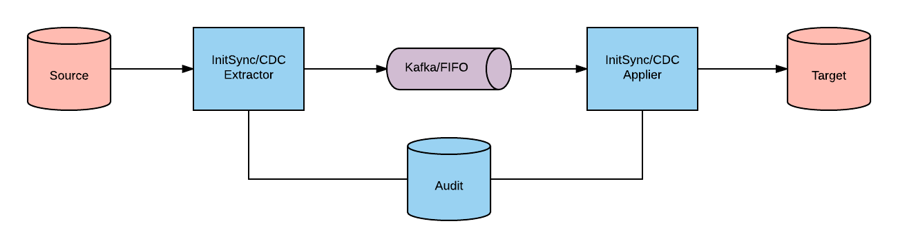
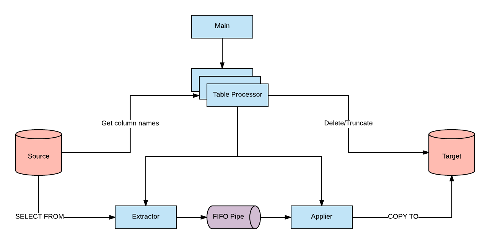
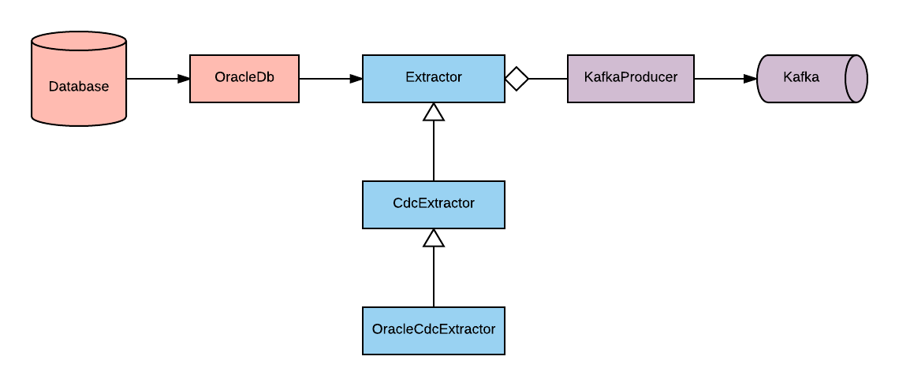
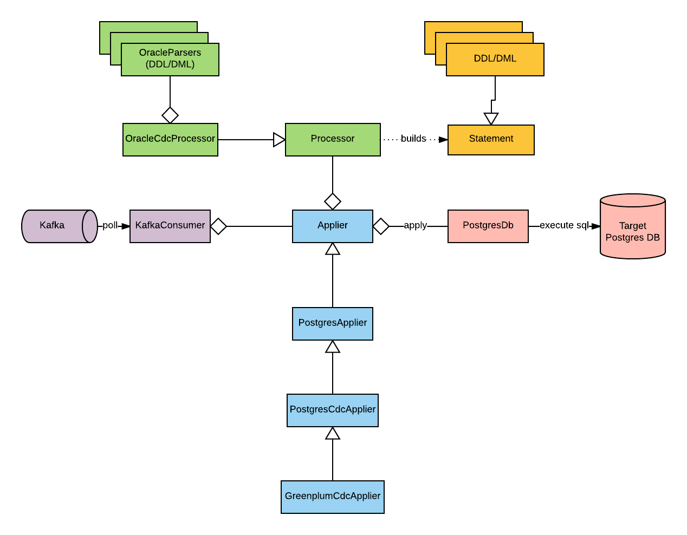

# Data Pipeline Design

| [Overview](/README.md) | [Initial Setup](/docs/INITIAL_SETUP.md) | Design |
|----|----|----|

## High Level Design
The following image illustrates a high-level design of the data pipeline application. 
It is very broadly grouped into two classes of functionality: Extractors and Appliers.

Extractors query data from a source database and write it to an intermediate landing area, be it kafka, fifo pipes or plain files.
Appliers read data from this intermediate landing area and apply them to a target database.

Central to each component is the Audit database, which is simply a RDBMS to maintain metadata from extract and apply runs, which ensures each component runs correctly, and provides visibility on the processes.

## InitSync Design
Note that, at the time of writing this, InitSync currently only supports an Oracle source and Postgres/Greenplum target.

The role of InitSync is to bulk copy data from a source to target database.

InitSync runs as a single module, spawning a dedicated process for each table configured in the source_system_profile table in the Audit Database.
Each of these table processes, in turn, creates the fifo pipe file then spawns two processes; an apply then an extract process.

The apply process, having started first, will "listen" on the fifo pipe for incoming data and will block indefinitely until the extract process commences sending through data or until the apply process is terminated by the parent table process. Once data is received, the apply process will commence executing a COPY TO command to the target database.

The extract process, upon startup, will execute a query against source and upon successful query execution, will commence writing "chunks" of records into the fifo pipe.

## Extractor Design
The Extractor component is designed to have as few moving parts as possible with the intention of keeping this component light-weight, performant and robust. This ensures data is persisted somewhere external to the source database before it is purged from the source database.

Its role is to extract, as quickly as possible, change data residing on source and immediately landing these records on an intermediate location which is accessible to Appliers; as such, the extractor does not inspect the raw source data at all. At the time of writing, this intermediate location is a Kafka topic, which also acts as a transport mechanism for delivering change data to Appliers.

The Extractor class itself is abstract, with the intention of reducing code duplication and making it as easy as possible to support new source databases.

The extractor is not concerned at all with Kafka offsets and instead, relies on SCNs/LSNs as bookmarks on where it is up to on source. A single extract of records is treated as a single batch which is queried using a start and end SCN/LSN. When writing a batch to a Kafka topic, the Extractor will firstly write a SOB (Start Of Batch) message prior to writing the change data messages, and finally write an EOB (End Of Batch) message.

## Applier Design
The Applier component's role is to consume change data records from the intermediate location (Kafka topic), parse the data, generate target DB compliant SQL statements based on the change data, and execute/commit these statements on target. In contrast to the Extractor, its logic is a bit more involved and requires parsing of raw source data, which naturally implies a greater likelihood of failure compared to the Extractor. As such, a recovery mechanism has been implemented with a goal of making it simple, efficient, and informative (for remediation) as possible.

The Applier class itself, similar to the Extractor, is abstract, with the aim of making it easier to extend for other bespoke target databases.

The Applier has a Processor which is responsible for parsing source change data which again, is abstract, to allow for extending for other target databases. The Processor knows what parsers are needed to process the source data to build a Statement object.
A Statement object is a representation of a SQL statement, containing all data necessary for building a SQL statement for any target database. The concrete Applier object will know how to convert such a statement to its specific target database type.

In contrast to the Extractor, the Applier is concerned mainly with Kafka offsets to know where it is up to.
During a run, the Applier will commit Kafka offsets (every "targetcommitpoint" records) into the Audit database along with executing a commit() on the target database, essentially creating save points for later recovery. Upon failure, the applier will recommence consumption of messages from the Kafka topic from the last saved Kafka offset from the Audit database.
If no failures occur, once the Applier sees an EOB message, it will synchronously commit the current offset position.

